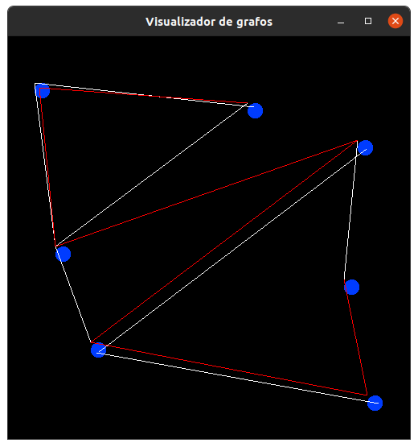
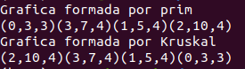

# Visualizador de grafos

## Librerias Requiridas:
* SFML
* g++
* make

## Instrucciones de compilacion

### Instalar la libreria:
Para correr el programa se necesitan las siguentes librerias:
```
libsfml-dev
build-essential
```
Se puede instalar con el manejador de paquetes preferido: eg 
```
sudo apt install libsfml-dev build-essential
```

### Compilacion

Para compilar el programa, se puede correr el `makefile` incluido, para eso, solo hay que poner en una terminal

```
make
```
Y automaticamente generara el binario llamado `sfml-app`

### A Mano:
Si no se desea usar el makefile, se puede hacer de la siguente manera
```
g++ -c main.cpp includes/* algorithms/* tests/*

g++ main.o -o sfml-app -lsfml-graphics -lsfml-window -lsfml-system
```
**NOTA**: Al compilar el programa de esta manera, generara archivos `.gch` en los folders de `includes`, `algorithms` y `tests` por lo que si se quiere modificar y volver a compilar, hay que borrarlos. Esto se puede hacer de la siguiente manera:
```
rm includes/*.gch algorithms/*.gch tests/*.gch
```
Es por eso que se recomienda usar el `make`
### Ejecucion
Para ejecutar el programa, hay que poner en una terminal el siguente comando:
```
./sfml-app
```
Para correr la parte de test de los algoritmos
```
./sfml-app test
```
Si se le pasan otros argumentos, continuara la ejecucion normal del programa
## Funcionalidades
El programa tiene por ahora, tres funcionalidades basicas:
* Añadir un nodo  -> dando click
* Unir dos nodos -> dando click a dos nodos
* Mover los nodos -> presionando la rueda del mouse sobre el nodo y mover el mouse sin soltarlo
* Borrar lo que esta en pantalla -> `Del`
* Ejecutar Prim -> presionar tecla `1` o `Numpad1`
* Ejecutar Kruskal -> presionar tecla `2` o `Numpad2`
* Limpiear las lineas coloreadas -> presionar tecla `0` o `Numpad0`
* Ejecutar Erdős–Rényi -> presionar tecla `3` o `Numpad3`
* Ejecutar Erdős–Rényi con m aristas -> tecla `4` o `Numpad4`
* Generar un Arbol Aleaotrio con n vertices -> tecla `5` o `Numpad5`
* Generar una Grafica Conexa aleatoria con n vertices -> tecla `6` o `Numpad6`

La entrada de algunos de los algoritmos a visualizar, se tiene que dar en consola
## Programa

El programa se ve asi:


Y despues de ejecutar Prim:


Ejecutando el de Krsukal



Los de los unit test:



