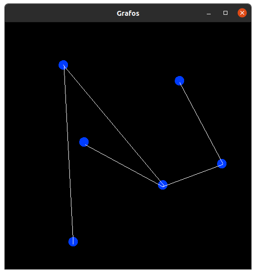
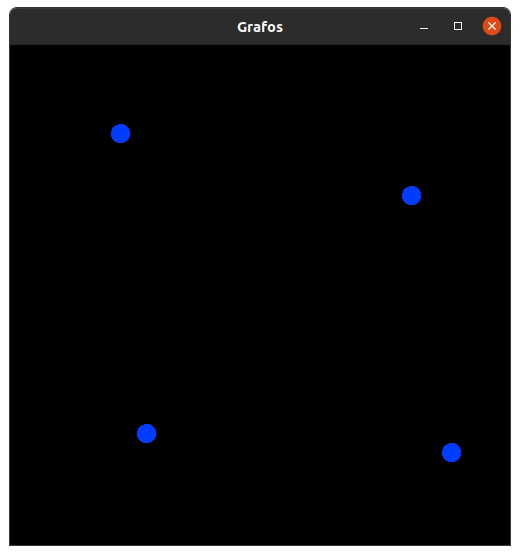
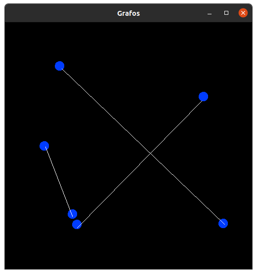
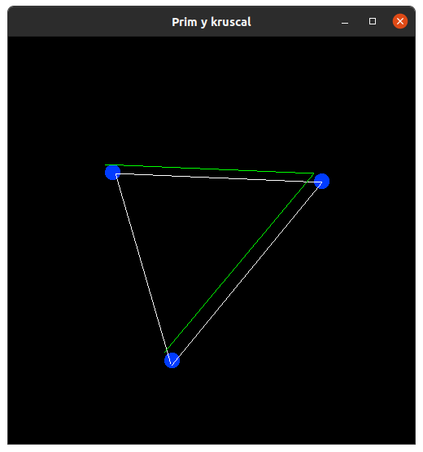

# Visualizador de grafos

## Librerias Requiridas:
* SFML
* g++
* make

## Instrucciones de compilacion

### Instalar la libreria:
Para correr el programa se necesitan las siguentes librerias:
```
libsfml-dev
build-essential
```
Se puede instalar con el manejador de paquetes preferido: eg 
```
sudo apt install libsfml-dev build-essential
```

### Compilacion

Para compilar el programa, se puede correr el `makefile` incluido, para eso, solo hay que poner en una terminal

```
make
```
Y automaticamente generara el binario llamado `sfml-app.o`

### A Mano:
Si no se desea usar el makefile, se puede hacer de la siguente manera
```
g++ -c main.cpp includes/edge.hpp includes/edge.hpp includes/node.hpp algorithms/prim.hpp

g++ main.o -o sfml-app.o -lsfml-graphics -lsfml-window -lsfml-system
```

### Ejecucion
Para ejecutar el programa, hay que poner en una terminal el siguente comando:
```
./sfml-app.o
```

## Funcionalidades
El programa tiene por ahora, tres funcionalidades basicas:
* Añadir un nodo  -> dando click
* Unir dos nodos -> dando click a dos nodos
* Mover los nodos -> presionando la rueda del mouse sobre el nodo y mover el mouse sin soltarlo
* Ejecutar prim -> presionar tecla `1` o `Numpad1`

## Programa

El programa se ve asi:





Y despues de ejecutar Prim:

